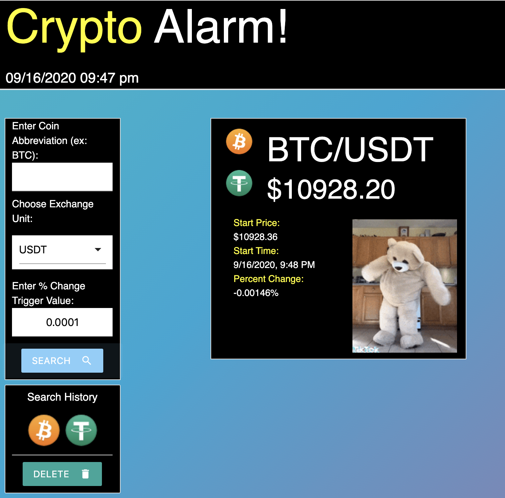

# Crypto-Alarm

## Purpose
A web application that displays current cryptocurrency values in relation to other currencies when entered as a pair. Values are fetched from the Binance exchange platform, and search history is stored locally and displayed in a clickable menu. 

## Built With
* HTML
* CSS
* JavaScript
* Moment.js
* Binance API
* Crypto Icons API
* Giphy API

## Website
https://team-7-hulk-smash.github.io/The-A-Project/

## Contribution
Made with heroic aggression by Team Hulk

### ©️2020 Team Hulk